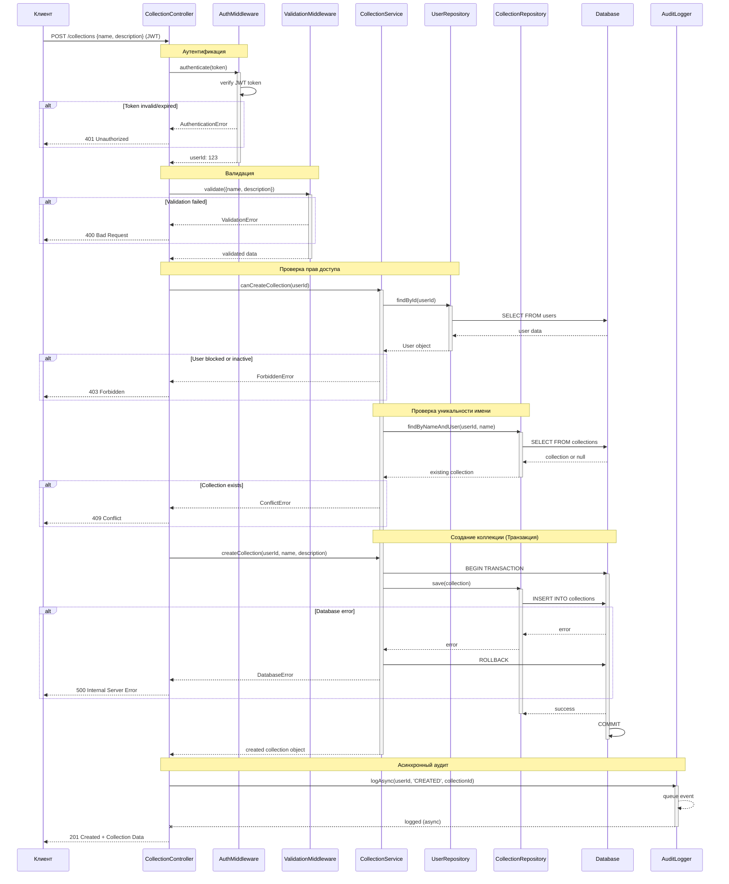

# word-learning-service-
# UML sequence diagram for the POST method. Creation of a new personal collection of words by the client.

```mermaid
sequenceDiagram
    participant Client as Клиент
    participant Controller as CollectionController
    participant AuthMiddleware as AuthMiddleware
    participant ValidationMiddleware as ValidationMiddleware
    participant CollectionService as CollectionService
    participant UserRepository as UserRepository
    participant CollectionRepository as CollectionRepository
    participant Database as Database
    participant AuditLogger as AuditLogger

    Client->>Controller: POST /collections {name, description} (JWT)
    
    Note over Controller, AuthMiddleware: Аутентификация
    Controller->>AuthMiddleware: authenticate(token)
    activate AuthMiddleware
    AuthMiddleware->>AuthMiddleware: verify JWT token
    alt Token invalid/expired
        AuthMiddleware-->>Controller: AuthenticationError
        Controller-->>Client: 401 Unauthorized
    end
    AuthMiddleware-->>Controller: userId: 123
    deactivate AuthMiddleware
    
    Note over Controller, ValidationMiddleware: Валидация
    Controller->>ValidationMiddleware: validate({name, description})
    activate ValidationMiddleware
    alt Validation failed
        ValidationMiddleware-->>Controller: ValidationError
        Controller-->>Client: 400 Bad Request
    end
    ValidationMiddleware-->>Controller: validated data
    deactivate ValidationMiddleware
    
    Note over Controller, UserRepository: Проверка прав доступа
    Controller->>CollectionService: canCreateCollection(userId)
    activate CollectionService
    CollectionService->>UserRepository: findById(userId)
    activate UserRepository
    UserRepository->>Database: SELECT FROM users
    Database-->>UserRepository: user data
    UserRepository-->>CollectionService: User object
    deactivate UserRepository
    
    alt User blocked or inactive
        CollectionService-->>Controller: ForbiddenError
        Controller-->>Client: 403 Forbidden
    end
    
    Note over CollectionService, CollectionRepository: Проверка уникальности имени
    CollectionService->>CollectionRepository: findByNameAndUser(userId, name)
    activate CollectionRepository
    CollectionRepository->>Database: SELECT FROM collections
    Database-->>CollectionRepository: collection or null
    CollectionRepository-->>CollectionService: existing collection
    deactivate CollectionRepository
    
    alt Collection exists
        CollectionService-->>Controller: ConflictError
        Controller-->>Client: 409 Conflict
    end
    
    Note over CollectionService, Database: Создание коллекции (Транзакция)
    Controller->>CollectionService: createCollection(userId, name, description)
    CollectionService->>Database: BEGIN TRANSACTION
    activate Database
    CollectionService->>CollectionRepository: save(collection)
    activate CollectionRepository
    CollectionRepository->>Database: INSERT INTO collections
    
    alt Database error
        Database-->>CollectionRepository: error
        CollectionRepository-->>CollectionService: error
        CollectionService->>Database: ROLLBACK
        CollectionService-->>Controller: DatabaseError
        Controller-->>Client: 500 Internal Server Error
    end
    
    Database-->>CollectionRepository: success
    deactivate CollectionRepository
    Database->>Database: COMMIT
    deactivate Database
    
    CollectionService-->>Controller: created collection object
    deactivate CollectionService
    
    Note over Controller, AuditLogger: Асинхронный аудит
    Controller->>AuditLogger: logAsync(userId, 'CREATED', collectionId)
    activate AuditLogger
    AuditLogger-->>AuditLogger: queue event
    AuditLogger--xController: logged (async)
    deactivate AuditLogger
    
    Controller-->>Client: 201 Created + Collection Data
```
